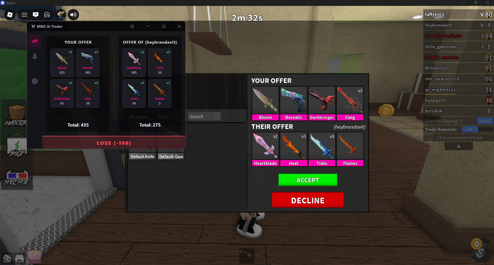
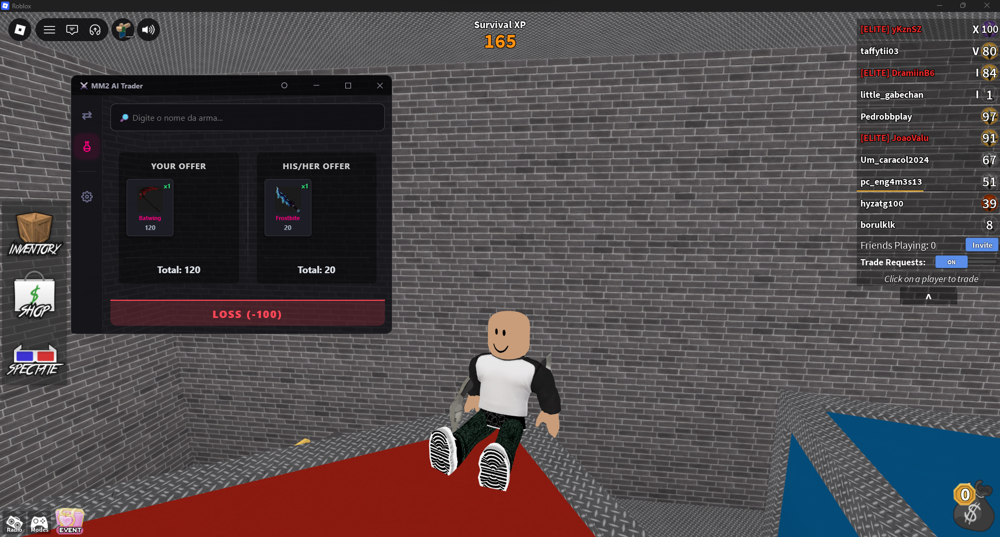
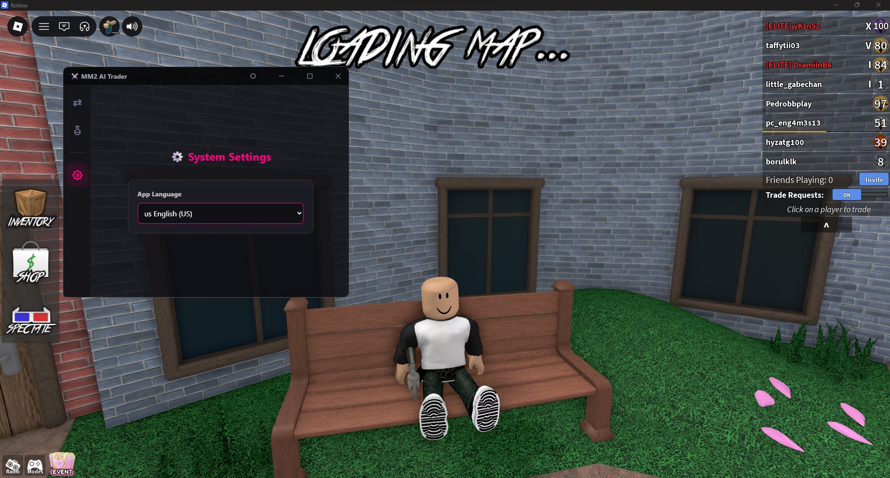
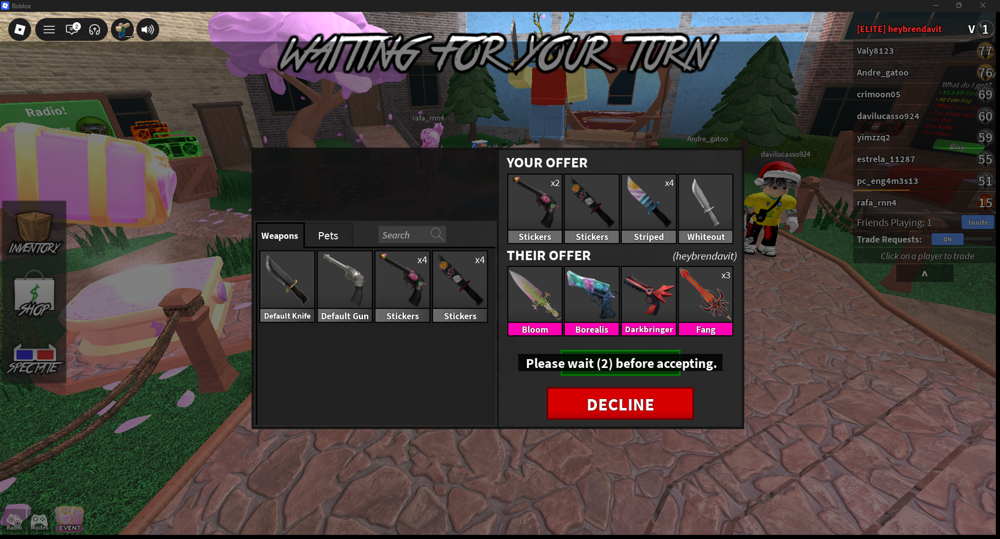
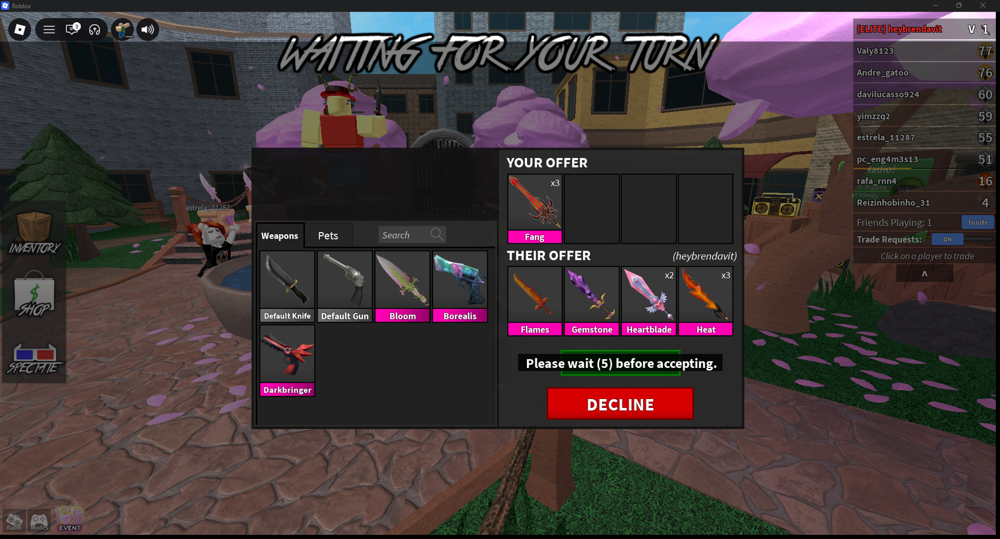
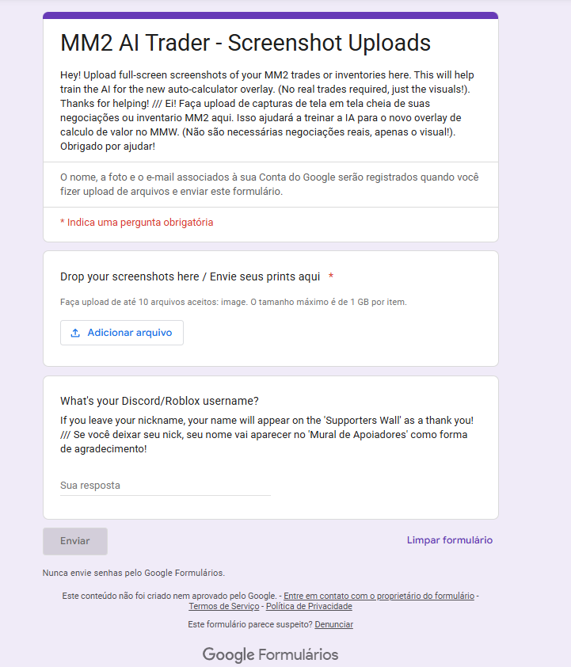
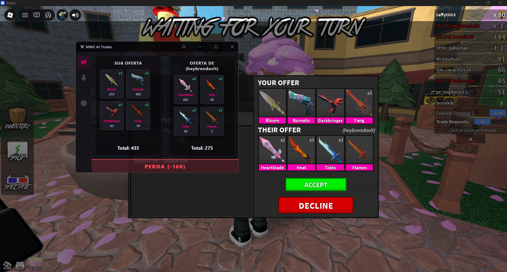
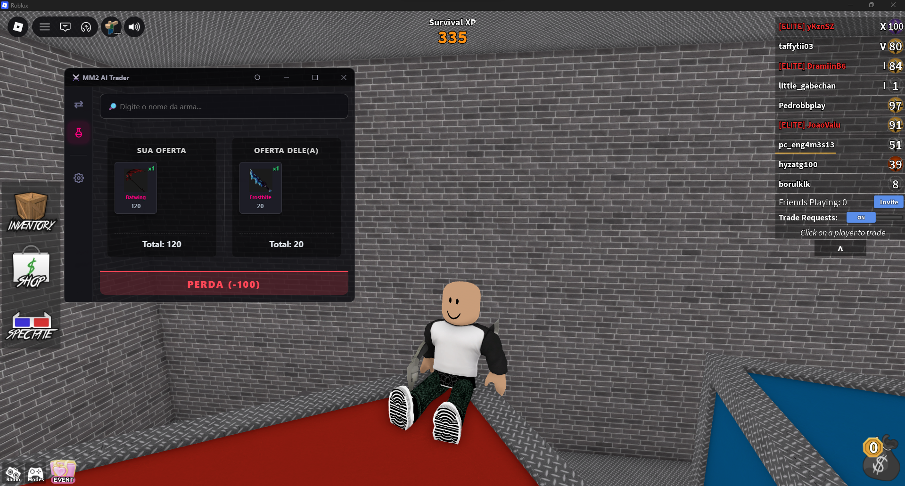
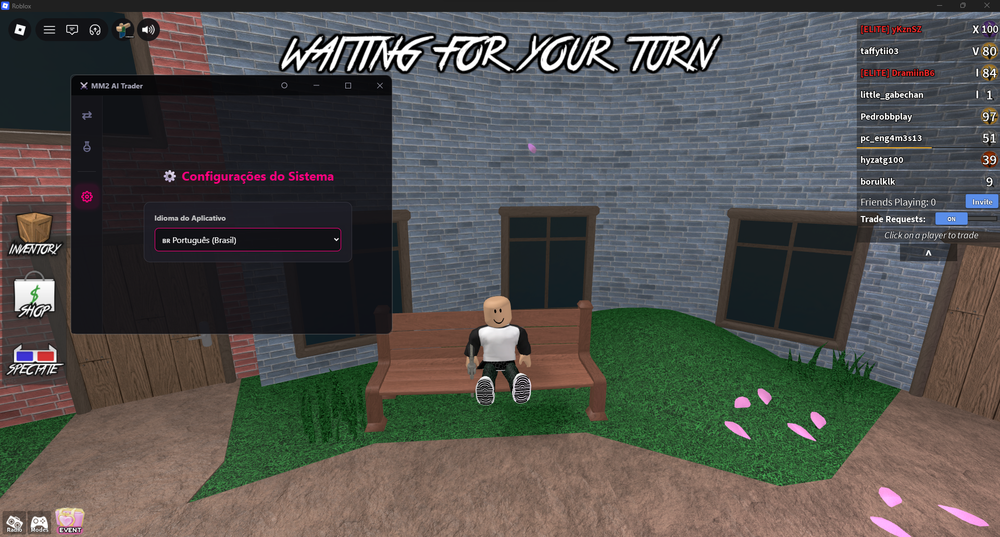

# MM2 Trade Hub 🔫🔪

> Real-time MM2 Values and Trade Calculator. (WIP)

🌎 **Choose your language / Escolha seu idioma:**
* [🇺🇸 English](#-english-version) *(Coming soon)*
* [🇧🇷 Português (Brasil)](#-versão-em-português)

---

## 🇺🇸 English Version

Welcome to the **MM2 Trade Hub**! This is a tool (currently in development) created to help Murder Mystery 2 players calculate trades quickly and visually. 

The ultimate goal is to create a smart "overlay" that reads real-time game economy values directly from your screen, making it easy to know if a trade is a "Win", "Loss", or "Fair".

### 📖 The Story, The Refactoring, and Who I Am
Anyone who plays MM2 knows the tension of having to calculate values fast so the other player doesn't cancel the trade, or worse, getting scammed because there was no time to add it all up. 

The first version of this project wasn't born for me, but to help my girlfriend, who played a lot of MM2 and made dozens of trades a day. To make her life easier, I created a Python script that recognized the screen and did the math. It worked, but it was a very limited, heavy, and slow tool.

Seeing how much this could help in practice, I decided to **refactor everything from scratch**, but this time for the entire community. The current project is being built with a robust and modern foundation using **React and Rust**, replacing that old script with a real Artificial Intelligence model, bringing a clean, fast, and 100% automated interface.

**A quick heads-up about me:** I'm just a 17-year-old in my 3rd (and final) year at a Federal Institute (High School/Technical School in Brazil). I'm developing the MM2 Trade Hub as a "hobby" and with a lot of passion, but since it's my senior year, I have my final graduation project (TCC) and other heavy commitments to balance. I promise to keep as committed as possible to make this project work and cross the finish line!

---

### 📸 What's Already Done

The project is coming to life in the graphical interface! Here are some previews of the current UI running side-by-side with the game:

---

### 🤖 Artificial Intelligence (I Need You!)

The screens above show the visual aspect of the ready project, **but at the moment, the real-time calculation is static**. 

For the app to be 100% automatic, I am training a Computer Vision (AI) model to read the Roblox trade window. And this is exactly where **I need the community's help!**

**📊 Current AI training progress:**
The model already has an **87.0% overall accuracy**, but we have a major visual hurdle:

* ✅ `gui_inventory`: 100%
* ✅ `gui_trade`: 100%
* ✅ `offer_label`: 100%
* ✅ `trade_progress`: 100%
* ✅ `trader_nickname`: 100%
* ✅ `weapon_icon`: 100%
* ✅ `weapon_name`: 100%
* ❌ **`quantity` (Quantity e.g., x2, x3, x4): 0.0%**

The AI is perfect at reading weapon names and icons, but **it is completely blind to quantity multipliers**. 

**🤝 How can you help train the model?**
Right now, our focus is **100% on the Computer (Desktop) interface!** I need a massive volume of images for the AI to learn. If you play MM2 on PC, **take full-screen screenshots** of your trade windows, especially those with duplicate items (x2, x3, x4)! (No real trades are required, just the visual).

*(Note: Screens where the Roblox window looks visually identical to the PC version are also welcome. In the future, if everything goes well, I'll try to release a Mobile version of the app, and then I'll ask for your help again with mobile screenshots!)*

*Examples of perfect screenshots to send me:*

**📥 Where to send the screenshots?**
To make it easier, I created a quick Google Forms to receive the uploads. 

🔗 **[Click here to access the form and submit your screenshots!](https://forms.gle/JYyAPSXY3MkQj6rx6)**

⚠️ **Disclaimer:** If you leave your Discord or Roblox username in the form, your name will appear on the app's future **'Supporters Wall'** as a thank you! 🏆

---

### 🛠️ Project Status
- [x] Initial Visual Interface (UI/UX)
- [x] Trade Simulation System
- [x] Live Trade Screen
- [x] Internationalization (PT-BR and EN implemented)
- [ ] Real-Time Economy Data Integration
- [ ] Screen Reading AI Model Completion (Training in progress 🚀)

---

### ☕ Support the Project (Coming Soon)
Building this entire ecosystem takes time, dedication, and a lot of energy! In the future, I will set up support platforms (like Ko-fi, Buy Me a Coffee, etc.) where you can support the project's development. 

**Why "Coming Soon"?** I will only open financial support platforms when the app is in its final stretch and I am sure I won't have unexpected issues with my school's final project (TCC). I think it would be really unfair to receive your support and fail to deliver the promised tool.

When the time comes, the funds will be completely separated for transparency:
* 🚀 **Support the App (Infrastructure):** Every cent raised here will go **100% to the project**. The goal is to use this for things like renting dedicated VIP servers for the MM2 Trade Hub community to trade.
* ☕ **Buy me a coffee (Developer):** A direct, personal support to me, to help keep me focused during late-night coding sessions! 😁

---

### 🤝 Future Partnerships and Ads
When the project is very close to the finish line, I will open up space for official partnerships! 

Being totally transparent about ads: I hate those random Google banners polluting the screen. Therefore, **IF** I ever put ads in the app, I promise they won't be annoying things that ruin your experience or your screen. The idea is to bring only and useful recommendations for gamers, like reliable stores to buy Robux or buy MM2 weapons. Everything 100% focused on the Roblox universe!

💖 **Thank you so much for reading this far, and a massive thanks to everyone sending in their screenshots and helping make this project a reality!**

---
## 🇧🇷 Versão em Português

Bem-vindo ao **MM2 Trade Hub**! Esta é uma ferramenta (atualmente em desenvolvimento) criada para ajudar os jogadores de Murder Mystery 2 a calcular trocas de forma rápida e visual. 

O objetivo final é criar um "overlay" inteligente que leia os valores reais da economia do jogo direto da sua tela, facilitando na hora de saber se uma troca vai te gerar Ganho, Perda ou se não vai mudar nada (Justa).

### 📖 A História, a Refatoração e Quem Sou Eu
Quem joga MM2 sabe a tensão que é ter que calcular valores correndo rápido para o outro jogador não cancelar a troca, ou pior, tomar *scam* porque não deu tempo de somar tudo. 

A primeira versão desse projeto nasceu não para mim, mas para ajudar a minha namorada, que jogava muito MM2 e fazia dezenas de trocas por dia. Para facilitar a vida dela, criei um script em Python que reconhecia a tela e fazia o cálculo matemático. Até funcionava, mas era uma ferramenta muito limitada, pesada e lenta.

Vendo o quanto isso podia ajudar na prática, decidi **refatorar tudo do zero**, mas dessa vez para a comunidade inteira. O projeto atual está sendo construído com uma base robusta e moderna usando **React e Rust**, e fazendo a substituição daquele script antigo por um modelo real de Inteligência Artificial, trazendo uma interface limpa, rápida e 100% automatizada.

**Um aviso rápido sobre mim:** Sou apenas um adolescente de 17 anos no 3º ano do Instituto Federal. Estou desenvolvendo o MM2 Trade Hub como um "hobby" e com muita paixão, mas como estou no meu último ano, tenho meu TCC e outros compromissos pesados para conciliar. Prometo manter o máximo de compromisso possível para fazer esse projeto dar certo e chegar até a linha de chegada!

---

### 📸 O que já está pronto

O projeto está ganhando vida na interface gráfica! Aqui estão algumas prévias da interface atual rodando lado a lado com o jogo:

---

### 🤖 Inteligência Artificial (Preciso de Você!)

As telas acima mostram o visual do projeto pronto, **mas no momento o cálculo em tempo real é estático**. 

Para que o aplicativo seja 100% automático, estou treinando um modelo de Visão Computacional (IA) para ler a janela de trade do Roblox. E é exatamente aqui que eu **preciso da ajuda da comunidade!**

**📊 Progresso atual do treinamento da IA:**
O modelo já está com **87.0% de precisão geral**, mas temos um grande obstáculo visual:

* ✅ `gui_inventory`: 100%
* ✅ `gui_trade`: 100%
* ✅ `offer_label`: 100%
* ✅ `trade_progress`: 100%
* ✅ `trader_nickname`: 100%
* ✅ `weapon_icon`: 100%
* ✅ `weapon_name`: 100%
* ❌ **`quantity` (Quantidade ex: x2, x3, x4): 0.0%**

A IA está perfeita para ler nomes e ícones de armas, mas **ela está completamente cega para os multiplicadores de quantidade**. 

**🤝 Como você pode ajudar a treinar o modelo?**
Neste primeiro momento, o nosso foco é **100% na interface de Computador (Desktop)!** Eu preciso de um volume gigante de imagens para a IA aprender. Se você joga MM2 no PC, **tire prints em tela cheia** das suas janelas de troca, especialmente daquelas que tenham itens repetidos (x2, x3, x4)! (Não são necessárias negociações reais, apenas o visual).

*(Nota: Telas onde a janela do Roblox fique visualmente idêntica à do PC também são bem-vindas. Futuramente, se tudo der certo, vou tentar lançar uma versão Mobile do app, e aí pedirei novamente a ajuda de vocês com prints de celular!)*

*Exemplos de prints perfeitas para me enviar:*

**📥 Onde enviar as prints?**
Para facilitar, criei um Google Forms rápido para receber os uploads. 

🔗 **[Clique aqui para acessar o formulário e enviar suas prints!](https://forms.gle/JYyAPSXY3MkQj6rx6)**

⚠️ **Aviso legal:** Se você deixar seu nick do Discord ou Roblox lá no forms, seu nome vai aparecer no futuro **'Mural de Apoiadores'** do aplicativo como forma de agradecimento!🏆

---

### 🛠️ Status do Projeto
- [x] Interface Visual (UI/UX) inicial
- [x] Sistema de Simulação de Trocas
- [x] Tela de Trocas ao Vivo
- [x] Internacionalização (PT-BR implementado)
- [ ] Integração com os Valores em Tempo Real da Economia
- [ ] Conclusão do Modelo de IA de Leitura de Tela (Treinamento em andamento 🚀)

---

### ☕ Apoie o Projeto (Em Breve)
Todo esse ecossistema leva tempo, dedicação e muita energia para ser construído! Futuramente, vou criar plataformas de apoio (como Apoia.se, Buy Me a Coffee, etc.) onde vocês poderão apoiar o desenvolvimento do projeto. 

**Por que "Em Breve"?** Eu só vou liberar as plataformas de apoio financeiro quando o aplicativo estiver na reta final e eu tiver certeza de que não terei imprevistos com o meu TCC ou com a escola. Eu acho muito "paia" receber o apoio de vocês e não conseguir entregar a ferramenta prometida.

Quando chegar a hora, os fundos serão totalmente separados por transparência:
* 🚀 **Apoie o App (Infraestrutura):** Todo valor arrecadado aqui será destinado **100% ao projeto**. O objetivo é usar isso para coisas como: alugar servidores VIPs próprios para a comunidade do MM2 Trade Hub negociar.
* ☕ **Me pague um café (Desenvolvedor):** Um apoio direto e pessoal a mim, para ajudar a manter o foco nas madrugadas de código! 😁

---

### 🤝 Futuras Parcerias e Anúncios
Quando o projeto estiver bem próximo da reta final, abrirei espaço para parcerias oficiais! 

Sendo bem transparente sobre a questão de anúncios: eu odeio aqueles banners aleatórios do Google poluindo a tela. Portanto, **SE** eu chegar a colocar anúncios no aplicativo, prometo que não serão coisas chatas que vão atrapalhar a sua experiência ou a sua tela. A ideia é trazer apenas recomendações bem "based" e úteis para quem joga, como lojas confiáveis para comprar Robux ou para comprar armas do MM2. Tudo 100% focado no universo Roblox!

💖 **Muito obrigado por ler até aqui, e um agradecimento gigante a todos que estão enviando suas prints e ajudando a transformar esse projeto em realidade!**